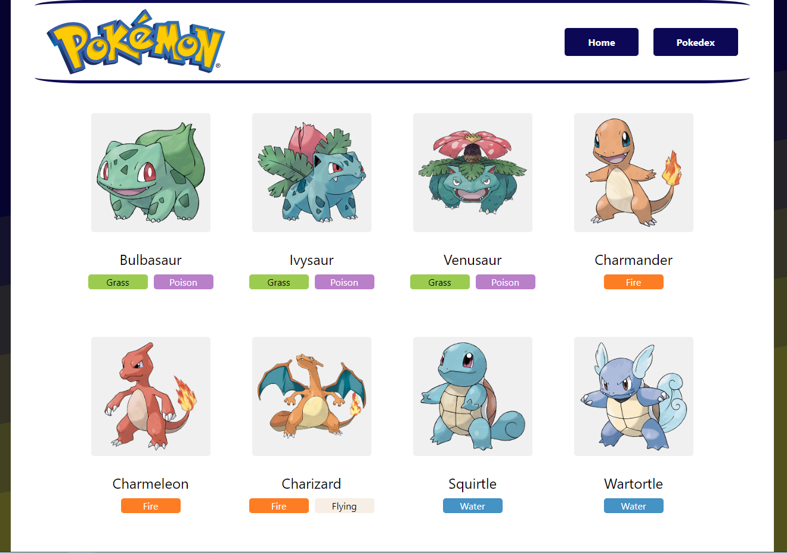
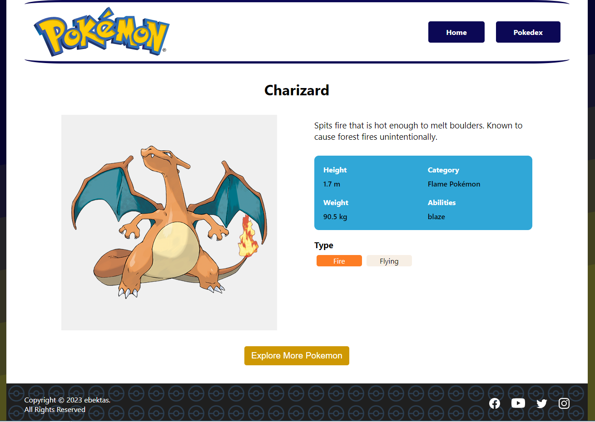
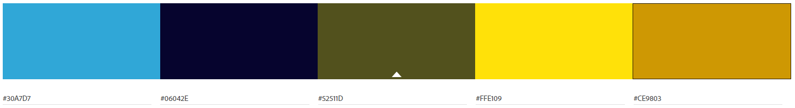

# PokemonProject

## Demo

The Pokemon project is available at [PokemonProject](https://pokemon-react-project.netlify.app/)

## Pages

The project consists of three pages:

- HomePage > The home page provides users with information about pokemon history and gameplay.
- PokedexPage > The pokedex page allows users to discover pokemons.
- PokemonDetailPage > The pokemon detail page allows users to access detailed information about a Pokemon.





## Color Palette



## Code structure

```
client
├── public
└── src
    |── assets
    |── components
    |── context
    └── pages
    App.js
    index.js
```
